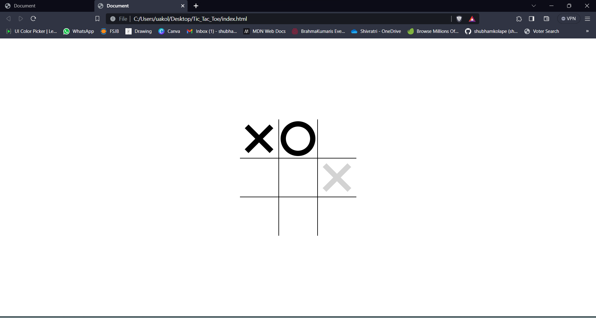

# Tic Tac Toe Game

This is a simple Tic Tac Toe game implemented using HTML, CSS, and JavaScript. It includes a feature that displays 'X' or 'O' when you hover over a cell to help players visualize their move.

## Features

- Interactive Tic Tac Toe game for two players.
- Hover effect to preview 'X' or 'O' placement.
- Displays game status (winner, draw, or ongoing) after each move.
- Reset button to start a new game.

 
 ## [Cilck here to Play](https://tictactoebyshubh.netlify.app/)

## Technologies Used

- HTML
- CSS
- JavaScript
